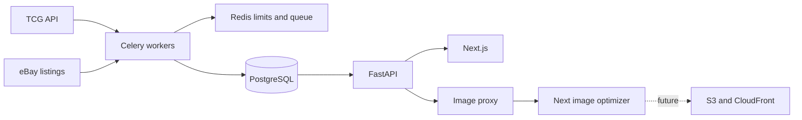

# TCGTerminal Architecture

TCGTerminal is a Pokémon card catalog and price tracker built around two external sources: TCG API for canonical catalog and market pricing, and eBay for future verified sold listings.

## System boundaries

- Next.js communicates only with FastAPI and never receives provider credentials.
- TCG API is the only catalog and non-sold market-price provider.
- eBay is the only planned sold-listing provider.
- Redis coordinates Celery and provider request limits.
- PostgreSQL is the source of truth served to the frontend.

## Catalog and pricing

The TCG API client lives in `backend/app/tcgapi/client.py` and uses `X-API-Key` authentication. It handles set/card pagination, retries 429 and transient 5xx failures, logs actionable request context, and enforces a Redis-backed daily safety limit.

Catalog sync reads Pokémon sets from `/v1/sets`, selects a bounded newest-set batch, reads cards from `/v1/sets/:id/cards`, and upserts sets before cards. New canonical card IDs come directly from TCG API. Price collection validates `/v1/cards/:id`, retrieves `/v1/cards/:id/prices`, and stores each printing's market price as a normalized observation.

The existing `sets` and `cards` schemas are protected and were not changed during the provider migration.

## Images

The database stores TCG API-provided source image URLs. FastAPI exposes stable local `/cards/:id/image` URLs and returns immutable one-year cache headers. The frontend uses `next/image` with responsive sizes, AVIF/WebP output, and a minimum 31-day optimized-image cache.

The AWS path is intentionally incremental: add an image-storage interface, mirror vetted originals into S3 under deterministic keys, and deliver them through CloudFront. This preserves the existing database column while avoiding an early dependency on cloud infrastructure.

## eBay implementation boundary

The eBay phase must introduce a typed adapter, raw immutable ingestion, conservative title resolution, verified sales, and derived statistics in separate migrations. It must not change `sets` or `cards`. Every title parsing rule belongs in `backend/parsers/title_matcher.py` and must be covered by edge-case unit tests.

Do not classify active eBay Browse listings as completed sales. Confirm the available eBay program and scopes before implementing ingestion.

## Deployment direction

- FastAPI and Celery: ECS/Fargate or App Runner.
- PostgreSQL: RDS with automated backups and a staging database for provider migrations.
- Redis: ElastiCache.
- Images: versioned S3 bucket plus CloudFront.
- Secrets: AWS Secrets Manager.
- Schedules and alerts: Celery Beat initially; EventBridge and CloudWatch as operational needs mature.

See `PROJECT_CONTEXT.md` for commands, current verification status, environment variables, and the prioritized roadmap.
