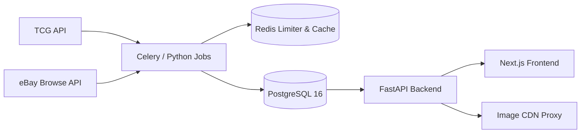

# TCGTerminal ⚡

> Real-time Pokémon card price tracking, grading arbitrage calculator, quantitative sealed investment signals, and verified eBay comp analytics.

[](https://nextjs.org/)
[](https://react.dev/)
[](https://fastapi.tiangolo.com/)
[](https://www.python.org/)
[](https://www.postgresql.org/)
[](https://redis.io/)
[](https://tailwindcss.com/)

---

## 🌟 Features

### 1. 🔍 Comprehensive Card Catalog & Search
- **32,800+ cards** and **237+ sets** across both English (`game=pokemon`) and Japanese (`game=pokemon-japan`) expansions.
- Multi-variant pricing: Holofoil, Reverse Holofoil, Normal, 1st Edition, and Unlimited.
- Advanced filtering by set, price sorting (`price_desc`, `price_asc`), card number, and toggleable sealed merchandise filters.

### 2. ⚡ Live Market Movers
- Track top price gainers and price drops across **24-hour**, **7-day**, and **30-day** rolling windows.
- Backend **Stale-While-Revalidate (SWR)** caching layer guarantees sub-50ms response times and zero user downtime during upstream provider rate limits.

### 3. 💎 Grading Profitability & Arbitrage Calculator
- Discover high-margin grading opportunities between raw cards and **PSA 10 / PSA 9** market comps.
- Interactive **Grading Fee Simulator** with live fee slider ($10–$100) and instant tier presets (PSA Bulk $19, PSA Value $24.99, PSA Regular $40, CGC/SGC $15).
- Filter by max buy-in price, minimum ROI/spread multipliers, and PSA 9 break-even safety.

### 4. 📦 Quantitative Sealed Investment Signals
- *"Invest with data, not opinions"* — algorithmic buy signals for booster boxes, ETBs, bundles, and cases.
- Deterministic 4-factor scoring model:
  - **Supply Scarcity** (30%)
  - **Buylist Liquidity** (25%)
  - **Momentum Velocity** (25%)
  - **Out-of-Print Vintage Age** (20%)
- Quantitative ratings: `STRONG BUY` ($\ge 75$), `BUY` ($60\text{--}74$), `HOLD` ($45\text{--}59$), and `UNDERPERFORM` ($<45$).

### 5. 🏆 Top 50 Pokémon Volume Leaderboard
- Aggregates and ranks the top 50 Pokémon characters by total market transaction value.
- Real-time YoY (Year-over-Year) volume comparisons with precompiled word-boundary regular expressions.

### 6. 🔴 Live Market Updates & Comps Feed
- Real-time chronological ticker of price observations, verified eBay comps, graded slab sales (PSA 10, PSA 9, CGC, BGS), and TCG API price syncs.
- Auto-refresh ticker with 15-second polling and live pulse indicator.

---

## 🛠️ Architecture & Tech Stack



- **Frontend**: Next.js 16 (App Router), React 19, Tailwind CSS 4, Recharts, TypeScript.
- **Backend**: Python 3.11+, FastAPI, SQLAlchemy 2, Alembic, Pydantic v2.
- **Storage & Ingestion**: PostgreSQL 16, Redis 7 (dual-layer rate limiter & distributed token cache), Celery.
- **External Providers**: [TCG API](https://tcgapi.dev) (Catalog & Market Prices) and eBay Developers APIs (Verified Listings & Comps).

---

## 🚀 Quick Start

### Prerequisites
- [Docker](https://www.docker.com/) & Docker Compose
- [Node.js](https://nodejs.org/) (v20+)
- [Python](https://www.python.org/) (v3.11+)

### 1. Clone & Setup Environment

```bash
git clone https://github.com/n8liu/tcgterminal.git
cd tcgterminal

# Create your local environment file
cp .env.example .env
```

Edit `.env` and add your API keys:
- `TCGAPI_API_KEY`: Your key from [tcgapi.dev](https://tcgapi.dev)
- `EBAY_CLIENT_ID` & `EBAY_CLIENT_SECRET`: Your eBay Developer keys (optional for eBay comps)

### 2. Start PostgreSQL & Redis

```bash
docker compose up -d
```

### 3. Setup & Run Backend

```bash
cd backend

# Create virtual environment and install dependencies
python3 -m venv .venv
source .venv/bin/activate
pip install -r requirements.txt

# Run migrations
alembic upgrade head

# Synchronize Pokémon catalog (English & Japanese)
python -m jobs.sync_catalog --all

# Start FastAPI server
uvicorn app.main:app --reload --port 8000
```

### 4. Setup & Run Frontend

```bash
cd ../frontend

# Install dependencies
npm install

# Start Next.js development server
npm run dev
```

Visit [http://localhost:3000](http://localhost:3000) in your browser.

---

## ⚙️ Background Ingestion & Price Cycling

To continuously update prices and collect market comps:

```bash
cd backend
source .venv/bin/activate

# Single price sync batch
python jobs/cycle_prices.py --tcg-limit 20 --ebay-limit 5

# Continuous daemon mode (runs every 60s)
python jobs/cycle_prices.py --continuous --interval 60 --tcg-limit 15 --ebay-limit 5
```

---

## 🧪 Testing & Verification

```bash
# Backend pytest suite (78 tests)
cd backend
.venv/bin/pytest

# Frontend typecheck & production build
cd ../frontend
npm run typecheck
npm run build
```

---

## 📄 License

This project is licensed under the [MIT License](LICENSE).
